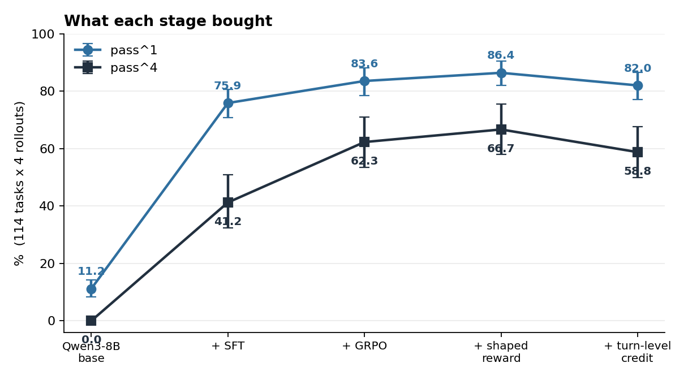
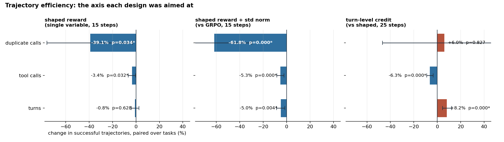
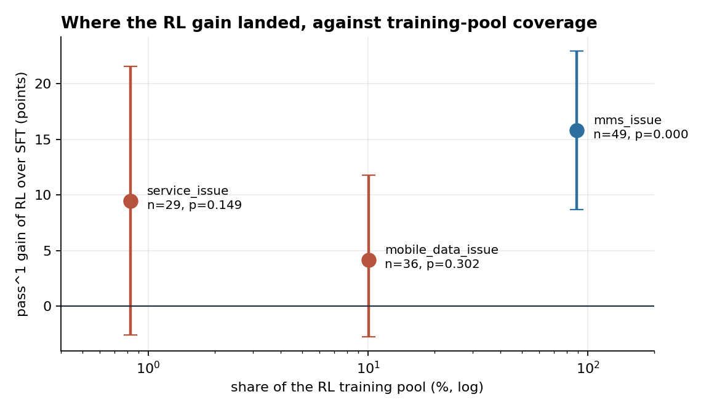

# Post-training a dual-control tool agent

Qwen3-8B on **τ²-bench telecom**, one A800. The agent diagnoses a phone's connectivity fault
by reading a policy manual and calling thirteen backend APIs — but **76% of the actions the
task expects must be performed by the customer**, on a handset the agent cannot touch. It has
to talk a simulated user through them. τ² calls this dual control, and it is what makes
turn-level credit assignment a real question here: turns do genuinely different things.

The reward is fully programmatic. `R = Π(env_assertions)` is a product of deterministic Python
assertions over device state, with no LLM judge anywhere — so this is **agentic RLVR**, and a
measured number means what it says.



| | pass^1 | pass^4 | protocol errors | mean turns |
|---|---|---|---|---|
| Qwen3-8B base | 11.2% | 0.0% | 62.4% | 22.9 |
| + SFT | 75.9% | 41.2% | 0.3% | 17.7 |
| + GRPO | 83.6% | 62.3% | 0.2% | 16.8 |
| **+ shaped reward** | **86.4%** | **66.7%** | 0.4% | 16.6 |
| + turn-level credit | 82.0% | 58.8% | 0.0% | 17.6 |

114 tasks × 4 rollouts under a protocol frozen before the first run
([docs/eval_protocol.md](docs/eval_protocol.md)). `pass^k` is τ²'s own metric: the chance that
all k of k drawn rollouts pass.

## What each stage actually bought

**SFT bought the action space, not reasoning.** 62.4% of the base model's tool results are
`Tool 'X' not found` — it calls the thirty tools that belong to the *customer's phone*, having
only thirteen of its own. Diagnosing that first set the SFT target: teacher selection on
pre-registered gates (Qwen3-14B: 65.8% protocol errors, 3.3% trajectory acceptance; DeepSeek:
0.0%, 71.8% — scaling inside the same family does not fix the confusion), then rejection
sampling 600 rollouts down to 269 examples. Protocol errors **62.4% → 0.3%**.

The accepted teacher trajectories are published as
[`cy-330/tau2-telecom-agent-sft`](https://huggingface.co/datasets/cy-330/tau2-telecom-agent-sft)
— 784 trajectories over 249 tasks, split by task, with zero overlap against the frozen
evaluation set.

**The stopping epoch was chosen on entropy, not loss.** Mean token entropy over assistant spans
runs 0.414 / 0.376 / 0.357 across three epochs against the base model's 0.281 — still above
base at epoch 3, so the policy has spread left for GRPO to explore. Training loss cannot answer
this: it keeps falling in a model whose output distribution has already degenerated.

**RL over the SFT checkpoint is +7.7 to +10.5 points** (paired bootstrap over tasks, p<0.005),
and `pass^4` 41.2% → 66.7% — what it bought is consistency, not single-shot capability.

The single change that made RL work was the learning rate. veRL's full-parameter PPO default of
1e-6, applied to a rank-16 LoRA adapter, moves the merged weights by at most **9.3e-07**; the
same adapter under SFT at 1e-4 moves by **3.5e-03**, four thousand times more. At 2e-5 the same
configuration went from +3.3 points with an interval crossing zero to **+8.1 points, p=0.0012**.

## Two reward designs, one worked



**Shaped reward — mined from trajectories, not intuition.** Two measurements set the form.
Every successful trajectory hits 100% of its expected actions, so action hits carry no
information *among successes*; and 65.8% of tasks have all four rollouts succeeding, where a
group-relative advantage is identically zero. So the two terms are made disjoint by
construction: `0.2·(1−R)·hit` separates failures from each other, `0.3·R·eff` ranks successes
by speed relative to their own group. An absolute form, `min(1, 15/T)`, was tried first and
produced a mean absolute advantage of 0.012 inside all-pass groups against 0.25–0.50 in mixed
ones — it would have been drowned; group-relative normalisation restores it to 0.105.

At fifteen steps, **at equal pass^1: 5.0% shorter successful trajectories and 61.8% fewer
repeated tool calls** (paired over 110 tasks, p<0.001).

**Turn-level credit — designed, implemented, and falsified.** Where the reward sits was decided
by replaying 430 trajectories offline: expected actions complete at a median relative position
of 0.54, the first decile of a trajectory holds **1 hit in 1,953**, and only 4.4% land on the
final turn. Discounting a terminal reward backwards is therefore the wrong direction here, so
credit propagates forward locally instead. The design holds two identities — the reward total is
byte-identical to the baseline's, and `β=0` reproduces the baseline bit for bit — pinned by
property tests and re-checked every training step (drift < 1.4e-07 over 25 steps). That makes
it the one genuinely single-variable comparison in the project.

It did not improve pass^1, and it lengthened trajectories by 8.2% (p<0.0001). The decomposition
says why: **every extra turn is a turn spent talking to the customer** (+11.3%, p<0.0001) while
backend tool turns do not move at all (+1.0%, p=0.54). Dual control puts 76% of expected actions
inside a user message, whose tokens carry no gradient, so credit is attributed backwards to the
assistant turn that *asked* — a message turn. The policy generalised the wrong invariant: not
"say this, here", but "produce more customer-facing turns".

Training reward did not rise (0.620 against the baseline's 0.624), which rules out reward
hacking. The objective was never exploited; the **attribution rule** put the gradient in the
wrong place.

## Where the gain landed



The RL pool (`full ∖ base`, 2171 tasks) and the frozen benchmark disagree sharply about what
telecom is: `mms_issue` is 89.1% of the pool and 43.0% of the benchmark, while `service_issue`
is **0.8% of the pool** (18 tasks in total) and 25.4% of the benchmark. Slicing the result by
issue: mms **+15.8 points, p<0.001**; mobile_data +4.2, p=0.30, already saturated at 90.3% after
SFT; service +9.5, p=0.15.

## How the numbers are kept honest

- **Frozen protocol**, written before the first run and never retuned after seeing a result.
- **A measured noise floor.** Two snapshots ten and fifteen steps into the *same* run differ by
  ±2.5 points on the same 114 tasks. Any claim smaller than that is not a claim.
- **Paired bootstrap over tasks** (10,000 resamples), never over rollouts: four rollouts of one
  fault share a solution and treating them as four samples understates every interval by about
  half. `scripts/rl_stats.py` recomputes every number in this file from the saved runs.
- Two conclusions were retracted after this machinery contradicted them, and three settings
  turned out to parse correctly while never being consumed — including one that made the
  baseline and the treatment differ by an extra variable nobody had written down. See
  [docs/results.md](docs/results.md).

## Layout

```
rl/tau2_agent_loop.py   drives a tau2 episode as a veRL agent loop
rl/credit.py            four advantage estimators behind algorithm.adv_estimator
rl/shape.py             where a reward sits inside a trajectory (pure, unit-tested)
rl/test_credit.py       17 property tests, including "beta=0 reproduces the baseline"
scripts/rl_arm.sh       one runner, one arm per argument
scripts/rl_stats.py     the results table and every paired test in this README
scripts/build_sft.py    teacher sampling, rejection, stratification, loss-mask verification
docs/results.md         the full lab record, including what was wrong and when
docs/eval_protocol.md   the frozen protocol
```

Released alongside this repository:
[`cy-330/tau2-telecom-agent-sft`](https://huggingface.co/datasets/cy-330/tau2-telecom-agent-sft)
on Hugging Face — the teacher trajectories the SFT stage was built from.

## Scope

On-policy RL with a verifiable reward, one GPU, single seed, 25 steps × 64 trajectories. No
reward model, no preference optimisation, no critic. The user simulator is frozen as DeepSeek
and is part of the environment: a published ablation on this benchmark moves the score by twenty
points when it is swapped, so any τ² telecom number is only meaningful together with it.
